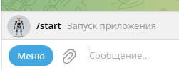
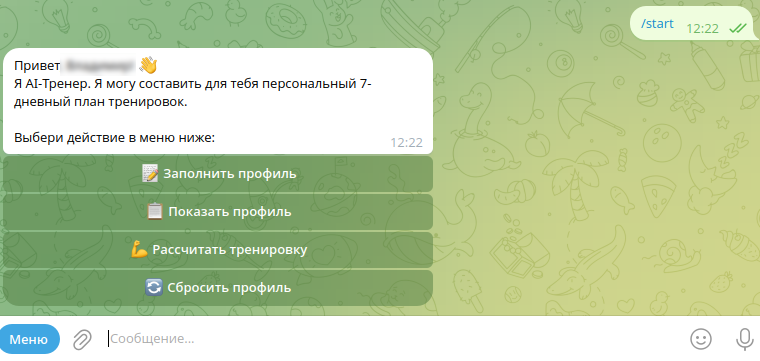

# 💪 Бот-тренер (@FitMin100Trener_bot) - Ваш личный тренер в Telegram

Забудьте о скучных универсальных тренировках. **Бот-тренер** создает программы, которые подходят именно *вам*.

## Как это работает?

### 1. Начало работы
При первом запуске бот приветствует вас и предлагает начать настройку персонального плана тренировок.

### 2. Приветствие после настройки
После заполнения профиля бот приветствует вас и подтверждает готовность к работе.

### 3. Заполнение профиля
Бот поэтапно собирает информацию о вас, чтобы составить максимально эффективную программу:
*   **Персональные данные и цель**
    
*   **Уровень подготовки и ограничения**
    
*   **Доступное оборудование**
    

### 4. Получение тренировки
Когда все данные собраны, бот использует **GigaChat** для генерации персональной тренировки:
*   **Основная часть программы**
    
*   **Дополнительные рекомендации**
    

## Попробуйте сами!

[@FitMin100Trener_bot](https://t.me/FitMin100Trener_bot) - Пройдите опрос и получите свою первую тренировку от личного цифрового тренера!

---

🔗 **Скриншоты бота тренера:** [Скриншоты @FitMin100Trener](../fitnssimg/Readme.md)

🔗 **Подробное описание проекта:** [Описание проекта](../Readme.md)
