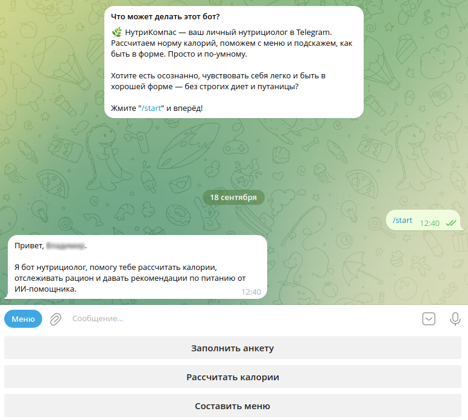
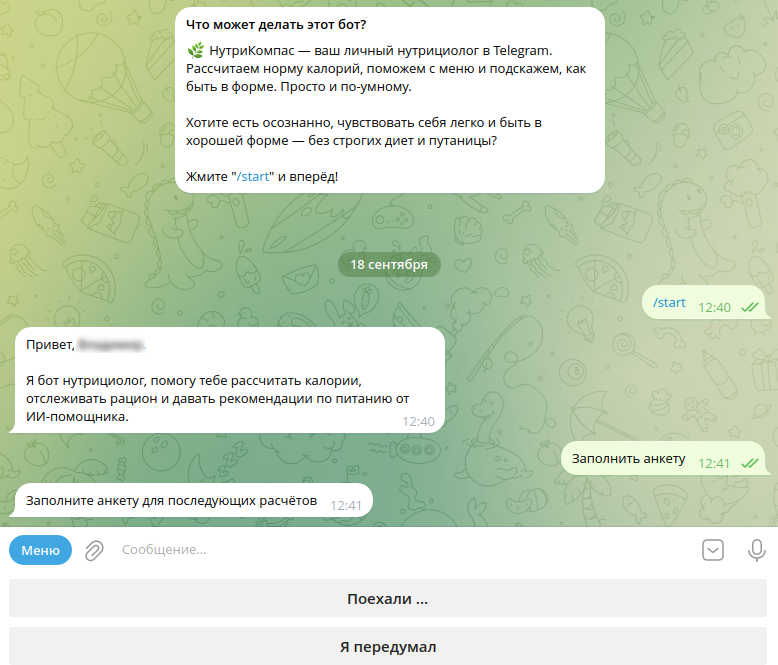
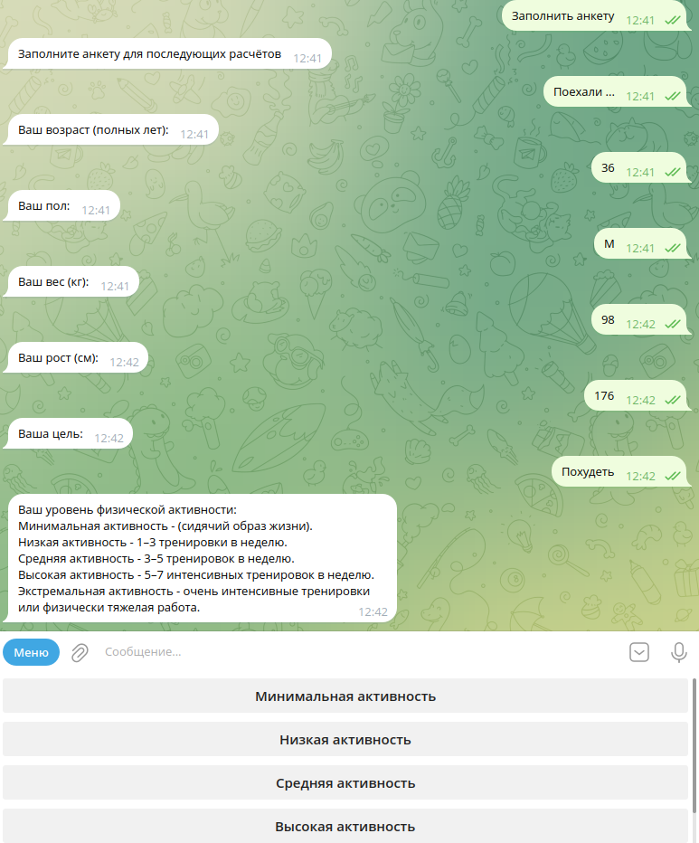

# 🍽️ НутриКомпасс (@NutriCompas_bot) - Ваш персональный диетолог

Представьте себе диетолога, который всегда под рукой и знает, чего именно *вам* не хватает в рационе. Именно таким является **НутриКомпасс**.

## Как это работает?

### 1. Начало работы
При первом запуске бот приветствует вас и предлагает начать настройку персонального плана питания.

### 2. Заполнение анкеты
Бот поэтапно собирает информацию о вас, чтобы составить максимально эффективный рацион:

### 3. Расчёт и рекомендации
После заполнения профиля бот использует **YandexGPT** для генерации персонального плана питания:
*   **Расчёт калорий и БЖУ**
  
    
*   **Примерное меню - Часть 1**
  
    
*   **Заключение и советы**
  
    

## Попробуйте сами!

[@NutriCompas_bot](https://t.me/NutriCompas_bot) - Заполните профиль и получите свой персональный план питания буквально за минуты!

---

🔗 **Скриншоты бота Фитнесс тренера:** [Перейти к скриншотам](../fitnessImg/Readme.md)

🔗 **Подробное описание проекта:** [Полное описание](../README.md)
